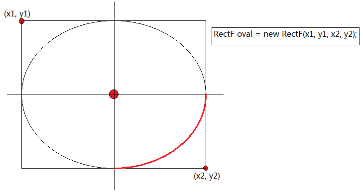

```java
public void arcTo (RectF oval, 
                float startAngle, 
                float sweepAngle)
```

简单说明：先定义一个矩形，然后以矩形中心为圆形画椭圆，截取椭圆的部分就是结果弧线



```java
startAngle = 0, sweepAngle = 90 (度)
```

水平方向向右为 0 度位置，垂直 90 度为 -90 度，顺时针方向为正