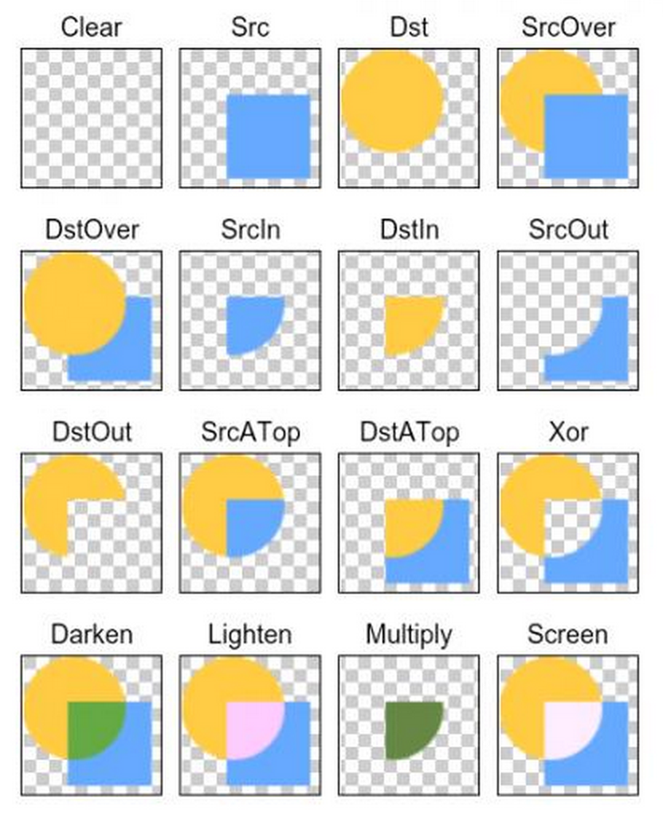

PorterDuffXfermode 图形混合模式


```java
Canvas canvas = new Canvas(dstBitmap);  
paint.setXfermode(new PorterDuffXfermode(Mode.SRC_IN));    
canvas.drawBitmap(srcBitmap, 0f, 0f, paint);     
```

其中黄圆是 Dst，蓝色正方形是 Src




